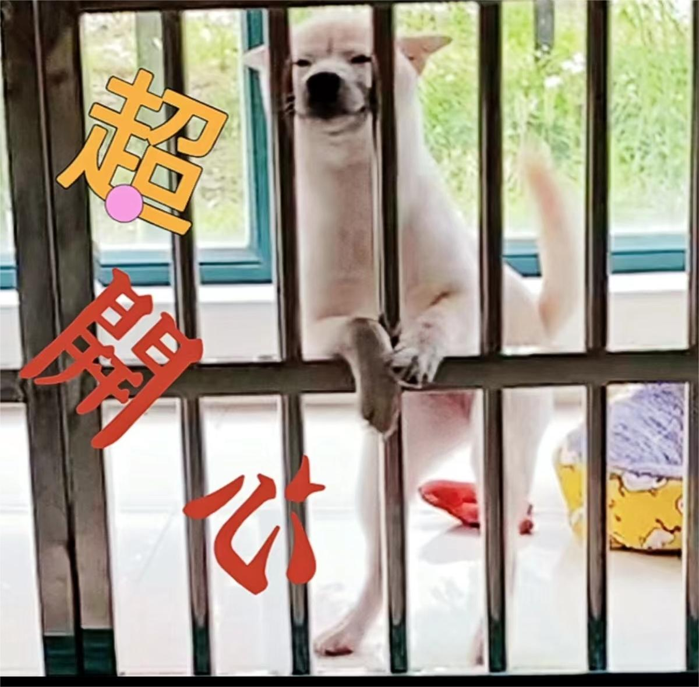

.. Docker Tips documentation master file, created by
   sphinx-quickstart on Fri May 14 11:29:29 2021.
   You can adapt this file completely to your liking, but it should at least
   contain the root `toctree` directive.

Headline e.g. Personal Notebook
=======================================

.. note::

   note abc。

.. toctree::
   :maxdepth: 2
   :caption: 目录:

   template-level-1
   docker-install
   about

Indices and tables
==================

* :ref:`genindex`
* :ref:`modindex`
* :ref:`search`
